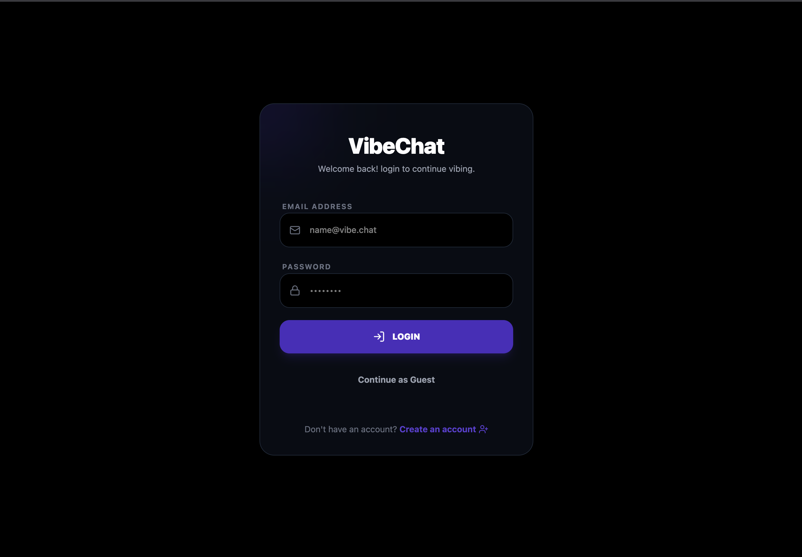
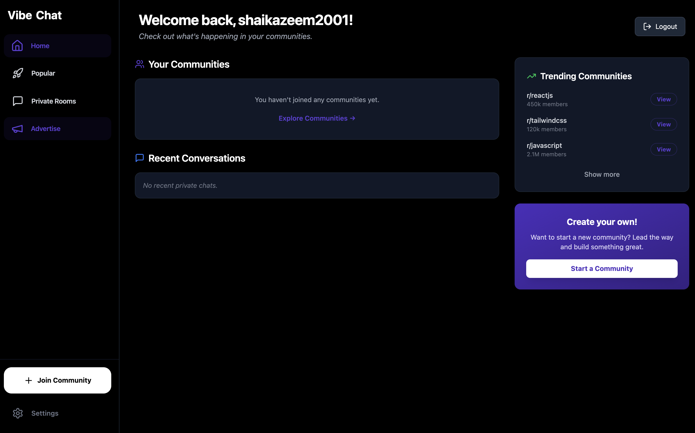
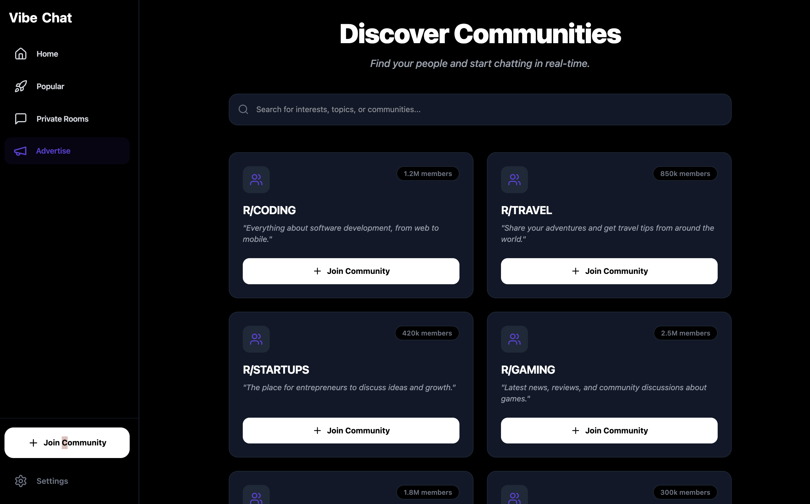
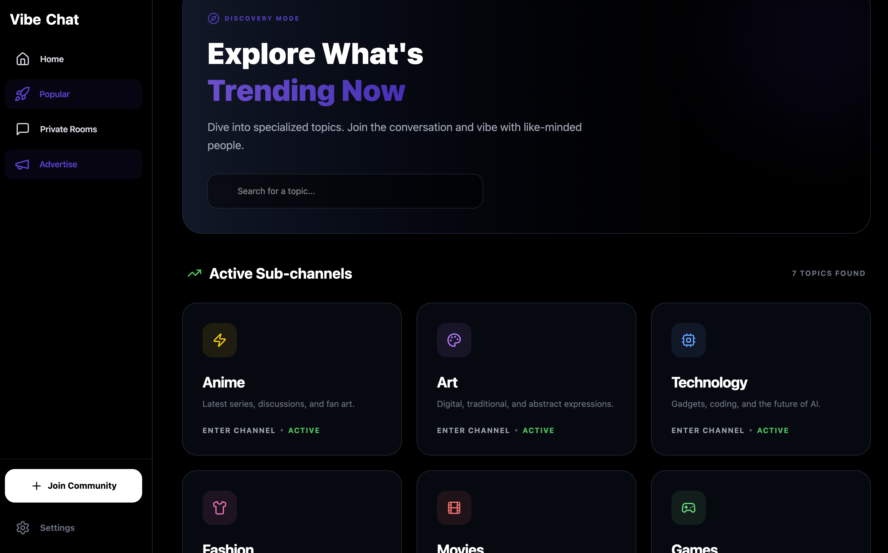

# 💬 Vibe Chat  
### A Real-Time Community Chat Platform

A modern full-stack chat application where users can discover communities, join public or private rooms, and communicate in real-time with a sleek, scalable architecture.

🚀 **Live Demo:**  
https://vibe-chat-8qwh6570f-shaikazeem2001s-projects.vercel.app/

---

---

## 🌟 Overview

Vibe Chat is a feature-rich real-time messaging platform inspired by modern community-based applications. It supports authentication, public and private chat rooms, and instant messaging using WebSockets.

This project demonstrates strong understanding of:

- Full-stack architecture  
- Real-time communication  
- REST APIs  
- Database design  
- Deployment workflows  

---

## 🚀 Key Features

- Secure Authentication (Signup / Login)
- Explore Trending Communities
- Join Public Channels
- Create & Join Private Rooms using Invite Codes
- Real-time Messaging with Socket.IO
- Modern Sidebar Navigation
- Dark Mode UI
- Responsive Design (Desktop & Mobile)

---

## 🖼️ Screenshots

### 🔐 Login Page

### 👤 Profile Page

### 🔥 Trending Communities

### 🌍 Explore Communities

### 🔒 Private Rooms

---

## 🧱 Tech Stack

### Frontend
- React
- Vite
- Tailwind CSS
- Socket.IO Client

### Backend
- Node.js
- Express.js
- MongoDB (Mongoose)
- Socket.IO

### Hosting
- Frontend → Vercel  
- Backend → Railway  

---

## ⚙️ Environment Variables

Create a `.env` file inside the **backend** folder:

