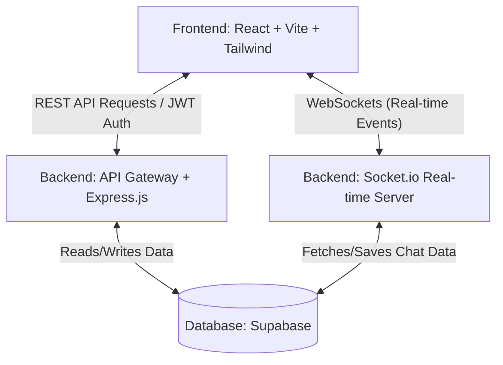
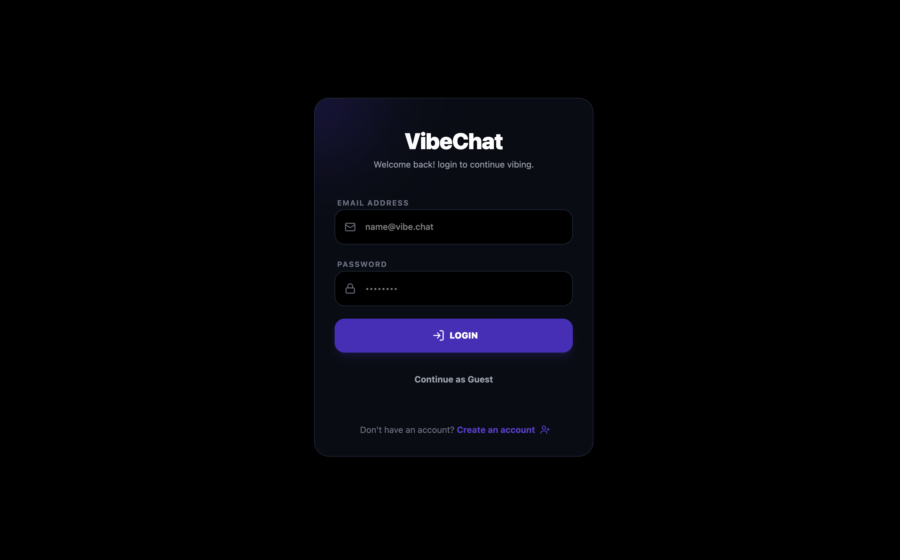
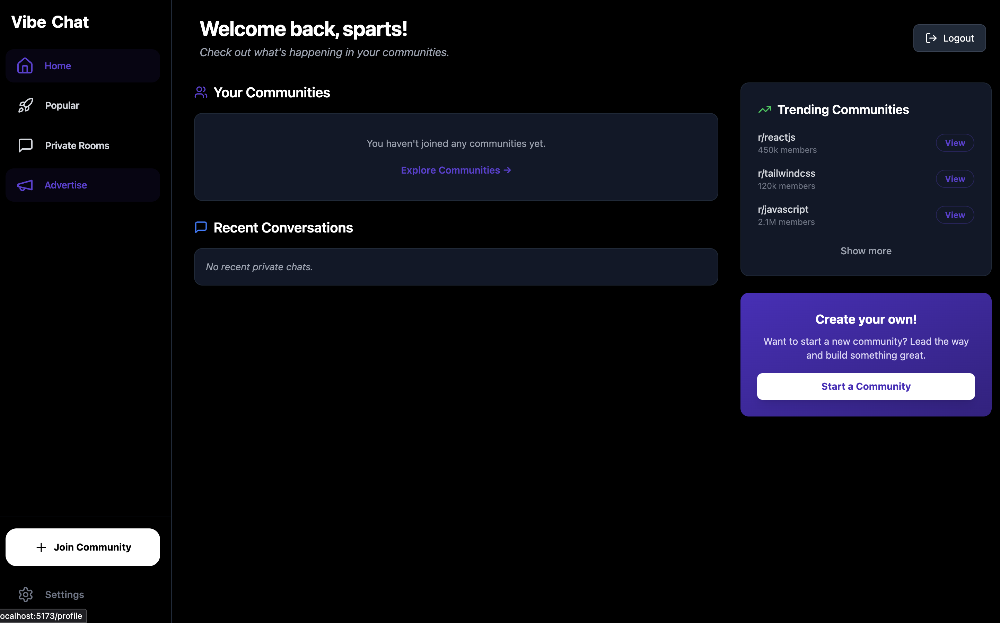
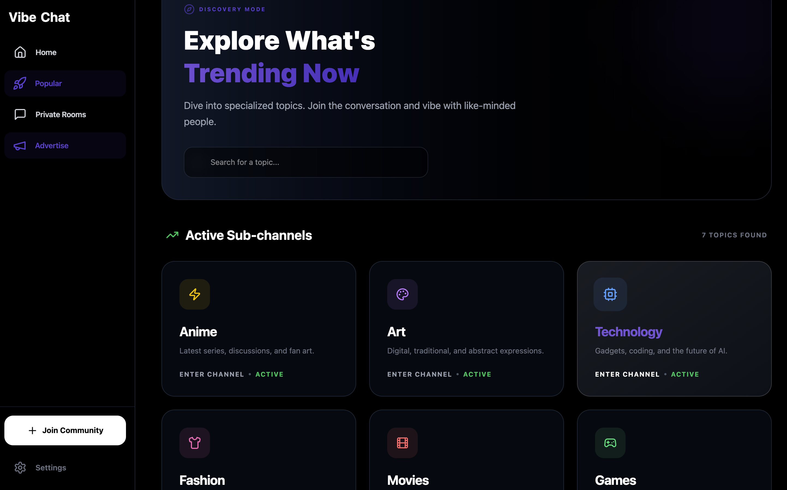
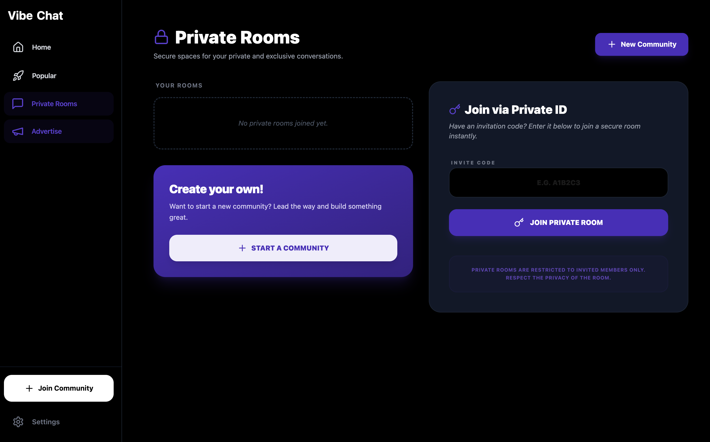
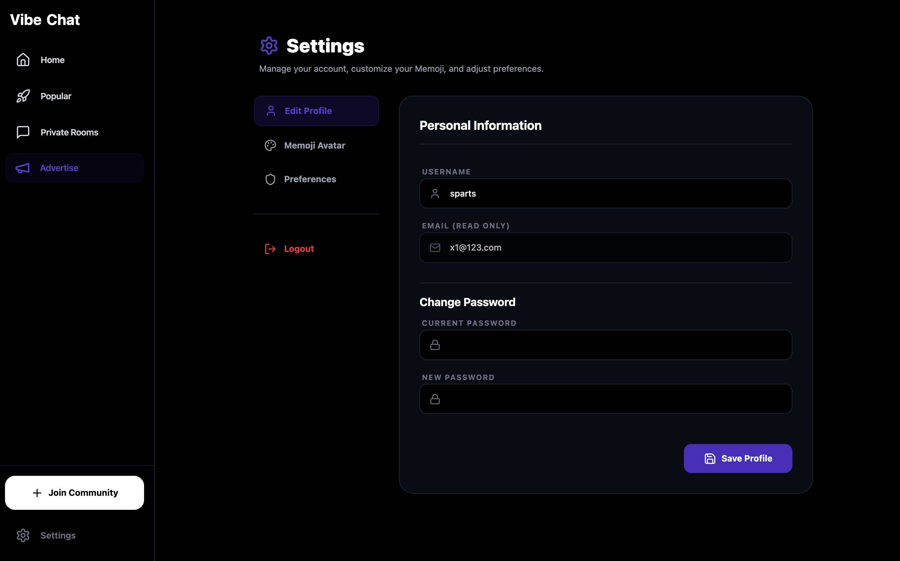

<div align="center">


# 💬 HEXA BYTE

### **Real-Time Community Chat Platform**

*Connect, communicate, and collaborate with communities worldwide*

[](https://vibe-chat-eta.vercel.app/)
[](LICENSE)

</div>

---

## 🌟 Project Overview

**HEXA BYTE** is a modern, feature-rich real-time messaging platform built for communities. Inspired by intuitive chat interfaces and powered by robust real-time technologies, it delivers enterprise-grade chat functionality with a beautiful, responsive design.

### The Problem It Solves
Traditional messaging apps often lack community-focused features or have steep learning curves. HEXA BYTE provides a seamless, scalable, and secure communication platform that brings communities together through real-time messaging, public/private rooms, and rich media sharing.

### Target Users
- **Communities & Groups**: Looking for organized, real-time communication.
- **Teams**: Needing dedicated spaces for collaboration.
- **Individuals**: Wanting to join public discussions or create private chat rooms.

### Key Highlights
- 🚀 **Production Ready**: Built with industry-standard MERN stack and Socket.io.
- ⚡ **Real-Time Experience**: Instant message delivery and live updates.
- 🔒 **Secure**: JWT authentication and secure data handling.
- 📱 **Responsive Design**: Flawless experience across desktop, tablet, and mobile.

---

## ✨ Features

- 🔐 **Authentication & Security**
  - Secure user registration and login with JWT.
  - Password hashing using bcrypt.
  - Protected API routes and protected UI views.
- 💬 **Real-Time Messaging**
  - Instant message delivery via Socket.IO.
  - Real-time online presence detection.
- 🏘️ **Community Management**
  - **Public Communities**: Open channels for everyone.
  - **Private Rooms**: Invite-only spaces.
  - Custom community creation.
- 🎨 **User Experience**
  - Clean, intuitive, and modern UI.
  - Customizable user avatars/profiles.
  - Mobile-first responsive layout.

---

## 🛠️ Tech Stack

### Frontend
-  **React.js (Vite)**
-  **Tailwind CSS**
-  **Axios**
-  **Socket.io-client**

### Backend
-  **Node.js**
-  **Express.js**
-  **Socket.io**
-  **Supabase (PostgreSQL)**

---

## 🏗️ System Architecture



The system follows a client-server architecture:
1. The **React frontend** communicates with the Express backend via REST API for authentication and static data.
2. The **Socket.io server** establishes a persistent WebSocket connection with clients for real-time messaging and events.
3. The backend uses **Supabase** acting as the PostgreSQL database host and data access layer.

---

## 📁 Project Structure

```text
HEXA-BYTE/
│
├── Backend/                 # Express.js Server
│   ├── config/              # Configuration files (Supabase, etc.)
│   ├── controllers/         # Request handlers
│   ├── middleware/          # Express middlewares (Auth, etc.)
│   ├── routes/              # API route definitions
│   ├── server.js            # Main application entry point
│   └── package.json         # Backend dependencies
│
└── sign-up/                 # React Frontend (Vite)
    ├── src/
    │   ├── api/             # Axios instance and API calls
    │   ├── assets/          # Static assets
    │   ├── components/      # Reusable UI components
    │   ├── pages/           # Application views/routes
    │   ├── App.jsx          # Root component
    │   └── main.jsx         # Application entry
    ├── vite.config.js       # Vite configuration
    ├── tailwind.config.js   # Tailwind CSS configuration
    └── package.json         # Frontend dependencies
```

---

## 🚀 Installation and Setup

### 1. Clone the repository
```bash
git clone https://github.com/shaikazeem2001/Vibe-chat.git
cd Vibe-chat
```

### 2. Set up the Backend
```bash
cd Backend
npm install
```

Create a `.env` file in the `Backend` directory (see Environment Variables section below).

Start the backend server:
```bash
npm run dev
# or
npm start
```

### 3. Set up the Frontend
Open a new terminal window:
```bash
cd sign-up
npm install
```

Create a `.env` file in the `sign-up` directory (see Environment Variables section below).

Start the frontend development server:
```bash
npm run dev
```

---

## 🔐 Environment Variables

### Backend (`Backend/.env`)
```env
# Supabase Configuration
SUPABASE_URL=your_supabase_project_url
SUPABASE_KEY=your_supabase_anon_key

# Authentication
JWT_SECRET=your_jwt_secret_key

# Chat SDK (if applicable)
STREAM_API_KEY=your_stream_api_key
STREAM_API_SECRET=your_stream_api_secret
```

### Frontend (`sign-up/.env`)
```env
# URL for the backend API
VITE_API_URL=http://localhost:9096

# Supabase Configuration (if needed directly on frontend)
VITE_SUPABASE_URL=your_supabase_project_url
VITE_SUPABASE_ANON_KEY=your_supabase_anon_key
```

---

## 📡 API Endpoints

| Method | Endpoint | Description | Auth Required |
|--------|----------|-------------|---------------|
| POST   | `/api/auth/register` | Register a new user | No |
| POST   | `/api/auth/login` | Authenticate an existing user | No |
| POST   | `/api/auth/logout` | Clear authentication cookies | Yes |
| GET    | `/api/auth/check` | Check if user is authenticated | Yes |
| GET    | `/api/messages/:roomId` | Get messages for a specific room | Yes |
| POST   | `/api/messages/upload/:roomId`| Upload a file attachment to a room| Yes |
| GET    | `/api/rooms` | Get list of available rooms | Yes |

---

## 💡 Usage Guide

1. **Sign Up / Login**: Users must create an account or log in to access the platform securely.
2. **Explore Communities**: Once logged in, users can view a list of default or popular rooms.
3. **Join a Room**: Clicking on a room connects the user via WebSocket to that specific channel.
4. **Chat**: Users can send real-time text messages which are broadcasted instantly to all other users in that room.
5. **Private Rooms**: Users can create private rooms and share the unique room name/ID with friends to chat privately.

---

## 🚢 Deployment

### Frontend (Vercel)
1. Push your code to GitHub.
2. Import the project in Vercel.
3. Set the Root Directory to `sign-up`.
4. Add the necessary Environment Variables.
5. Deploy.

### Backend (Render)
1. In the Render dashboard, create a new Web Service connected to your GitHub repo.
2. Set the Root Directory to `Backend`.
3. Set Build Command: `npm install`
4. Set Start Command: `npm start`
5. Add the environment variables from your `.env` file.
6. Deploy.

---

## 📸 Screenshots / Demo

### 🔐 Authentication Pages
<div style="display: flex; justify-content: space-between;">
  
  
</div>

### 🏠 Home Dashboard


### 🌍 Explore Communities


### 🔒 Private Rooms


### ⚙️ Settings


---

## 🚀 Future Improvements

- [ ] Implement fully-featured Voice and Video calling channels.
- [ ] Add rich text formatting (Markdown) support for messages.
- [ ] Read receipts and typing indicators.
- [ ] Push notifications for mentions and direct messages.

---

## 🤝 Contributing

Contributions are what make the open-source community such an amazing place to learn, inspire, and create. Any contributions you make are **greatly appreciated**.

1. Fork the Project
2. Create your Feature Branch (`git checkout -b feature/AmazingFeature`)
3. Commit your Changes (`git commit -m 'Add some AmazingFeature'`)
4. Push to the Branch (`git push origin feature/AmazingFeature`)
5. Open a Pull Request

---

## 📄 License

Distributed under the MIT License. See `LICENSE` for more information.

---

## ✍️ Author

**Azeem Shaik**
- GitHub: [@shaikazeem2001](https://github.com/shaikazeem2001)
- LinkedIn: [Azeem Shaik](https://www.linkedin.com/in/azeem-shaik-817886233/33)

